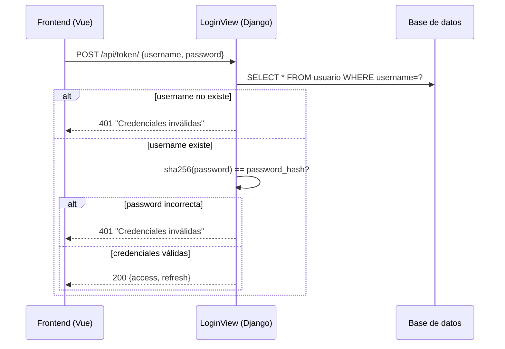

# Design Document — login-username

## Overview

Esta feature reemplaza el campo `email` como identificador de login por un `username` (alias corto único). El cambio abarca cuatro capas:

1. **Modelo** — agregar `username` al modelo `Usuario` con restricción `unique=True`.
2. **Autenticación** — actualizar `LoginView` y `obtener_tokens_para_usuario` para operar sobre `username`.
3. **Serializers** — hacer `username` obligatorio en registro y exponerlo en perfil.
4. **Frontend** — reemplazar el campo email del formulario de login por `username`.
5. **Migración** — generar `username` automáticamente para usuarios existentes desde su `email`.

No se elimina el campo `email` del modelo; se mantiene para comunicaciones futuras.

---

## Architecture

El flujo de autenticación actual es:

```
LoginView (POST /api/token/)
  └─ busca Usuario por email + password_hash
  └─ obtener_tokens_para_usuario → JWT con {user_id, email, rol}

AutenticacionJWTUsuario
  └─ extrae user_id del token
  └─ resuelve Usuario.objects.get(id=user_id)
```

Después de la feature:

```
LoginView (POST /api/token/)
  └─ busca Usuario por username + password_hash
  └─ obtener_tokens_para_usuario → JWT con {user_id, username, rol}

AutenticacionJWTUsuario
  └─ extrae user_id del token  ← sin cambios
  └─ resuelve Usuario.objects.get(id=user_id)  ← sin cambios
```

El `Autenticador` ya resuelve por `user_id`, por lo que no requiere cambios funcionales — solo se actualiza el payload del token para incluir `username` en lugar de `email`.



---

## Components and Interfaces

### Backend

#### `usuarios/models.py` — modelo `Usuario`

Agregar campo:
```python
username = models.CharField(max_length=50, unique=True, validators=[RegexValidator(r'^[a-zA-Z0-9_-]+$')])
```

El campo `email` se mantiene sin cambios.

#### `usuarios/views.py` — `LoginView`

Cambiar lookup de `email` → `username`:
```python
# Antes
usuario = Usuario.objects.get(email=email, password_hash=password_hash)

# Después
usuario = Usuario.objects.get(username=username, password_hash=password_hash)
```

El campo del request pasa de `email` a `username`. El mensaje de error unificado `"Credenciales inválidas"` aplica tanto a username inexistente como a password incorrecta (no se distinguen para evitar enumeración de usuarios).

#### `usuarios/authentication.py` — `obtener_tokens_para_usuario`

Reemplazar `email` por `username` en el payload JWT:
```python
# Antes
refresh['email'] = usuario.email

# Después
refresh['username'] = usuario.username
```

`AutenticacionJWTUsuario.authenticate` no requiere cambios: ya resuelve por `user_id`.

#### `usuarios/serializers.py`

- `UsuarioRegistroSerializer`: agregar `username` a `fields`, con validación de patrón `^[a-zA-Z0-9_-]+$`.
- `UsuarioPerfilSerializer`: agregar `username` a `fields`.

#### `usuarios/migrations/` — migración de datos

Se necesitan dos migraciones:
1. `0002_usuario_username_nullable.py` — agrega `username` como `null=True, blank=True` (necesario para aplicar sobre datos existentes).
2. `0003_populate_username.py` — migración de datos: genera `username` desde `email` para cada usuario existente.
3. `0004_usuario_username_not_null.py` — hace `username` `NOT NULL` y `unique=True`.

Alternativamente, se puede hacer en una sola migración con `RunPython` que primero popula y luego altera la columna. La opción de tres pasos es más explícita y segura.

**Algoritmo de generación de username:**
```python
def generar_username(email):
    base = email.split('@')[0]
    # sanitizar: conservar solo [a-zA-Z0-9_-]
    base = re.sub(r'[^a-zA-Z0-9_-]', '_', base)[:50]
    if not Usuario.objects.filter(username=base).exists():
        return base
    i = 1
    while True:
        candidate = f"{base[:48]}_{i}"  # respetar max_length=50
        if not Usuario.objects.filter(username=candidate).exists():
            return candidate
        i += 1
```

### Frontend

#### `frontend/src/views/LoginView.vue`

- Reemplazar el campo `email` (type="email") por `username` (type="text").
- Cambiar etiqueta a `"Usuario"`.
- Agregar validación client-side: si el campo está vacío al enviar, mostrar `"El usuario es requerido"` sin llamar a la API.
- Mapear HTTP 401 → `"Usuario o contraseña incorrectos"`.

#### `frontend/src/stores/auth.js`

- Cambiar la firma de `login(email, password)` → `login(username, password)`.
- Enviar `{ username, password }` en lugar de `{ email, password }`.

---

## Data Models

### Modelo `Usuario` (después de la migración)

| Campo | Tipo | Restricciones |
|---|---|---|
| id | BigAutoField | PK |
| nombre | CharField(150) | — |
| username | CharField(50) | unique, `^[a-zA-Z0-9_-]+$` |
| email | EmailField | unique (se mantiene) |
| password_hash | CharField(255) | — |
| rol | CharField(10) | choices: admin/empleado |
| creado_en | DateTimeField | auto_now_add |

### Payload JWT (después del cambio)

```json
{
  "user_id": 1,
  "username": "jperez",
  "rol": "empleado",
  "exp": 1234567890,
  "iat": 1234567890
}
```

### Contrato del endpoint de login

**Request:**
```json
POST /api/token/
{ "username": "jperez", "password": "mi_contraseña" }
```

**Response exitosa (200):**
```json
{ "access": "<jwt>", "refresh": "<jwt>" }
```

**Response de error (401):**
```json
{ "detail": "Credenciales inválidas" }
```

---

## Correctness Properties

*A property is a characteristic or behavior that should hold true across all valid executions of a system — essentially, a formal statement about what the system should do. Properties serve as the bridge between human-readable specifications and machine-verifiable correctness guarantees.*

### Property 1: Username inválido es rechazado

*For any* string que contenga al menos un carácter fuera del conjunto `[a-zA-Z0-9_-]`, intentar crear un `Usuario` con ese valor como `username` debe ser rechazado con un error de validación.

**Validates: Requirements 1.2, 3.2**

---

### Property 2: Username duplicado retorna HTTP 400

*For any* `username` que ya exista en la base de datos, intentar registrar un segundo `Usuario` con ese mismo `username` debe retornar HTTP 400.

**Validates: Requirements 1.1, 1.3**

---

### Property 3: Credenciales inválidas retornan 401 con mensaje correcto

*For any* combinación de `username` inexistente o `password` incorrecta enviada al endpoint de login, el sistema debe retornar HTTP 401 con el mensaje `"Credenciales inválidas"`, sin distinguir cuál de los dos campos es incorrecto.

**Validates: Requirements 2.2, 2.3**

---

### Property 4: Login exitoso retorna JWT con campos requeridos

*For any* `Usuario` con credenciales válidas, el login debe retornar un JWT cuyo payload contenga exactamente los campos `user_id`, `username` y `rol` con los valores correspondientes al usuario autenticado, y el autenticador debe resolver ese token a ese mismo usuario usando únicamente `user_id`.

**Validates: Requirements 2.1, 2.4, 2.5**

---

### Property 5: Registro sin username es rechazado

*For any* payload de registro que omita el campo `username` o lo envíe vacío, el serializer debe rechazarlo con un error de validación antes de persistir.

**Validates: Requirements 3.1**

---

### Property 6: Perfil expone username y oculta password_hash

*For any* usuario autenticado, la respuesta del endpoint `/api/usuarios/me/` debe incluir el campo `username` con el valor correcto y no debe contener el campo `password_hash`.

**Validates: Requirements 3.3, 3.4**

---

### Property 7: Login exitoso almacena token y redirige por rol

*For any* usuario con credenciales válidas, tras un login exitoso el store de autenticación debe contener el `access_token` y la redirección debe corresponder al rol del usuario (admin → vista de admin, empleado → vista de empleado).

**Validates: Requirements 4.4**

---

### Property 8: Generación de username produce valores únicos derivados del email

*For any* conjunto de usuarios existentes con emails arbitrarios, la función de generación de username debe producir un valor derivado de la parte local del email de cada usuario, y todos los valores generados deben ser únicos entre sí.

**Validates: Requirements 5.1, 5.2**

---

### Property 9: Migración preserva datos existentes

*For any* conjunto de usuarios existentes antes de la migración, todos sus campos originales (`id`, `nombre`, `email`, `password_hash`, `rol`, `creado_en`) deben tener los mismos valores después de ejecutar la migración.

**Validates: Requirements 5.3**

---

## Error Handling

| Situación | Capa | Respuesta |
|---|---|---|
| `username` con caracteres inválidos | Serializer / Model validator | HTTP 400 con detalle del_id."` |
| `user_id` del token no existe en DB | `AutenticacionJWTUsuario` | HTTP 401 `"Usuario no encontrado."` |
| Campo `username` vacío en formulario | Frontend (Vue) | Mensaje inline `"El usuario es requerido"`, sin petición HTTP |
| HTTP 401 desde el backend | Frontend (Vue) | Mensaje `"Usuario o contraseña incorrectos"` |

**Principio de seguridad:** los errores de login no distinguen entre "username no existe" y "password incorrecta" para evitar enumeración de usuarios.

---

## Testing Strategy

### Enfoque dual

Se usan dos tipos de tests complementarios:

- **Tests unitarios / de integración** (`pytest` + `pytest-django`): verifican ejemplos concretos, casos borde y condiciones de error.
- **Tests de propiedades** (`hypothesis`): verifican propiedades universales sobre rangos amplios de inputs generados.

### Librería de property-based testing

Se usa **[Hypothesis](https://hypothesis.readthedocs.io/)** para Python. Cada test de propiedad debe ejecutarse con un mínimo de 100 ejemplos (`settings(max_examples=100)`).

### Tests de propiedades (backend)

Cada propiedad del diseño se implementa con un único test de Hypothesis. El tag de referencia sigue el formato:

`# Feature: login-username, Property N: <texto de la propiedad>`

| Propiedad | Test | Estrategia de generación |
|---|---|---|
| P1: Username inválido rechazado | `test_username_invalido_rechazado` | `st.text()` filtrado para incluir al menos un carácter fuera de `[a-zA-Z0-9_-]` |
| P2: Username duplicado → 400 | `test_username_duplicado_retorna_400` | `st.from_regex(r'^[a-zA-Z0-9_-]{1,50}$')` para generar usernames válidos |
| P3: Credenciales inválidas → 401 | `test_credenciales_invalidas_retornan_401` | `st.text()` para usernames/passwords inexistentes |
| P4: JWT con campos correctos | `test_login_exitoso_jwt_payload` | Usuarios generados con `st.builds(Usuario, ...)` |
| P5: Registro sin username rechazado | `test_registro_sin_username_rechazado` | Payloads de registro con `username` omitido o vacío |
| P6: Perfil expone username, oculta password_hash | `test_perfil_campos_correctos` | Usuarios con distintos usernames generados |
| P8: Generación de username única | `test_generacion_username_unica` | Listas de emails generadas con `st.lists(st.emails())` |
| P9: Migración preserva datos | `test_migracion_preserva_datos` | Usuarios con campos aleatorios antes de migración |

### Tests unitarios (backend)

Enfocados en ejemplos concretos y casos borde:

- `test_email_se_mantiene_en_modelo` — verifica que el campo `email` sigue existiendo (Req. 1.4).
- `test_login_con_email_falla` — verifica que enviar `email` en lugar de `username` al endpoint retorna error.
- `test_username_max_50_chars` — verifica que un username de 51 caracteres es rechazado.
- `test_username_solo_guion_valido` — verifica que `-` y `_` solos son usernames válidos.

### Tests de componente (frontend)

Usando **Vitest** + **@vue/test-utils**:

- `test_campo_usuario_presente` — verifica que el formulario tiene etiqueta "Usuario" (Req. 4.1, ejemplo).
- `test_mensaje_401_correcto` — verifica que HTTP 401 muestra "Usuario o contraseña incorrectos" (Req. 4.3, ejemplo).
- `test_username_vacio_muestra_error` — verifica que enviar formulario vacío muestra "El usuario es requerido" sin llamar a la API (P7).

### Configuración de Hypothesis

```python
from hypothesis import settings, HealthCheck

# Aplicar a todos los tests de propiedad de esta feature
@settings(max_examples=100, suppress_health_check=[HealthCheck.too_slow])
```
